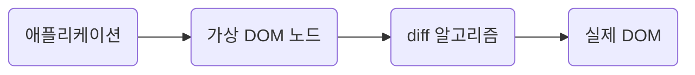

# frameworkless-frontend

### 목차

[chapter2 - 렌더링](#렌더링)  
<br>

## 2. 렌더링

### 렌더링 함수

```ts
view = f(state);
```

DOM 요소가 애플리케이션의 상태에만 의존하도록 하기 위해서, 순수 함수로 요소를 렌더링하도록 작성하였다.  
`requestAnimationFrame`을 기반으로 작성하였고, `repaint`가 이벤트 루프에서 스케줄링 되기 직전에 callback이 실행되기 때문에 효율적으로 DOM을 조작할 수 있다.  
<br>

### Component 함수

[data-attributes](https://developer.mozilla.org/ko/docs/Learn/HTML/Howto/Use_data_attributes)를 사용하여 component의 이름을 넣었다.(data-component)  
component registry를 이용하여, data-component의 속성 값과 일치하는 렌더링 함수를 사용하도록 한다.

```ts
const registry = {
  todos: todosView,
  counter: counterView,
  filters: filtersView,
};
```

추가로, root component에서 하위 모든 component의 data-component의 속성 값을 읽고, 재귀적으로 렌더링을 수행하도록 개선하자.  
렌더링 함수를 순수 함수로 작성하였기 때문에 [렌더링 함수를 래핑하는 고차함수(HOC)](https://github.com/iamsungjinkim/frameworkless-frontend/blob/c3ed108fa9cf91cb8c52c95019ae03c40c707b12/src/registry/index.ts#L21)를 사용한다.  
<br>

### 가상 DOM

기존의 DOM과 새롭게 렌더링된 DOM을 통째로 교체하는 방식은 큰 프로젝트에서 성능을 저하시킬 수 있다.  
간단히 `reconciliation`을 구현해보자. [코드](https://github.com/iamsungjinkim/frameworkless-frontend/blob/master/src/utils/applyDiff.ts)



- 속성 수가 다르다.
- 하나 이상의 속성이 변경됐다.
- 노드에 자식이 없으며, textContent가 다르다.

위의 조건으로 간단히 diff 알고리즘을 구현하였다.

> ✅ 추가로 알고리즘을 개선해볼만한 부분.
>
> ```html
> // before
> <div>
>   before text
>   <ul>
>     <li>리스트1</li>
>     <li>리스트2</li>
>   </ul>
> </div>
>
> // after
> <div>
>   after text
>   <ul>
>     <li>리스트1</li>
>     <li>리스트2</li>
>   </ul>
> </div>
> ```
>
> - [`Element.childNodes`](https://developer.mozilla.org/ko/docs/Web/API/Node/childNodes)
> - [`Node.nodeType`](https://developer.mozilla.org/en-US/docs/Web/API/Node/nodeType)
