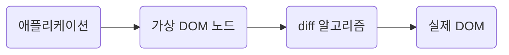

# frameworkless-frontend

### 목차

[chapter2 - 렌더링](#렌더링)  
[chapter3 - DOM 이벤트 관리](#dom-이벤트-관리)
<br>

## 2. 렌더링

### 렌더링 함수

```ts
view = f(state);
```

DOM 요소가 애플리케이션의 상태에만 의존하도록 하기 위해서, 순수 함수로 요소를 렌더링하도록 작성하였다.  
`requestAnimationFrame`을 기반으로 작성하였고, `repaint`가 이벤트 루프에서 스케줄링 되기 직전에 callback이 실행되기 때문에 효율적으로 DOM을 조작할 수 있다.  
<br>

### Component 함수

[data-attributes](https://developer.mozilla.org/ko/docs/Learn/HTML/Howto/Use_data_attributes)를 사용하여 component의 이름을 넣었다.(data-component)  
component registry를 이용하여, data-component의 속성 값과 일치하는 렌더링 함수를 사용하도록 한다.

```ts
const registry = {
  todos: todosView,
  counter: counterView,
  filters: filtersView,
};
```

추가로, root component에서 하위 모든 component의 data-component의 속성 값을 읽고, 재귀적으로 렌더링을 수행하도록 개선하자.  
렌더링 함수를 순수 함수로 작성하였기 때문에 [렌더링 함수를 래핑하는 고차함수(HOC)](https://github.com/iamsungjinkim/frameworkless-frontend/blob/c3ed108fa9cf91cb8c52c95019ae03c40c707b12/src/registry/index.ts#L21)를 사용한다.  
<br>

### 가상 DOM

기존의 DOM과 새롭게 렌더링된 DOM을 통째로 교체하는 방식은 큰 프로젝트에서 성능을 저하시킬 수 있다.  
간단히 `reconciliation`을 구현해보자. [코드](https://github.com/iamsungjinkim/frameworkless-frontend/blob/master/src/utils/applyDiff.ts)



- 속성 수가 다르다.
- 하나 이상의 속성이 변경됐다.
- 노드에 자식이 없으며, textContent가 다르다.

위의 조건으로 간단히 diff 알고리즘을 구현하였다.

> ✅ 추가로 알고리즘을 개선해볼만한 부분.
>
> ```html
> // before
> <div>
>   before text
>   <ul>
>     <li>리스트1</li>
>     <li>리스트2</li>
>   </ul>
> </div>
>
> // after
> <div>
>   after text
>   <ul>
>     <li>리스트1</li>
>     <li>리스트2</li>
>   </ul>
> </div>
> ```
>
> - [`Element.childNodes`](https://developer.mozilla.org/ko/docs/Web/API/Node/childNodes)
> - [`Node.nodeType`](https://developer.mozilla.org/en-US/docs/Web/API/Node/nodeType)

<br>

## 3. DOM 이벤트 관리

이벤트의 등록은 [`EventTarget.addEventListener`](https://developer.mozilla.org/ko/docs/Web/API/EventTarget/addEventListener)를 이용한다.

> ❗️ DOM에 요소가 더이상 존재하지 않으면 메모리 누수를 방지하기 위하여 [`EventTarget.removeEventListener`](https://developer.mozilla.org/ko/docs/Web/API/EventTarget/addEventListener)를 사용해서 이벤트를 제거해줘야 한다.

렌더링 함수(view)의 인터페이스를 수정하여 events를 추가해주고, eventListener를 부착해준다.

```ts
// index.ts
const events = {
  deleteItem: (index: number) => {
    state.todos.splice(index, 1);
    render();
  },
  addItem: (text: string) => {
    state.todos.push({
      text,
      completed: false,
    });
    render();
  },
};

const render = () => {
  window.requestAnimationFrame(() => {
    const main = document.querySelector("#root");
    const newMain = registry.renderRoot(main, state, events);

    applyDiff(document.body, main, newMain);
  });
};
```

### 이벤트 위임

`data attributes`와 `event bubbling`을 이용하여 이벤트 위임을 적용한다.

```ts
// view/todos.ts
const getTodoElement = (todo, index) => {
  // ...
  element.querySelector("button.destroy").dataset.index = index;

  return element;
};

export default (targetElement, state, events) => {
  // ...
  newTodoList.addEventListener("click", (e) => {
    if (e.target.matches("button.bestroy")) {
      events.deleteItem(e.target.dataset.index);
    }
  });

  return newTodoList;
};
```

> ❗️ 이벤트 핸들러가 부착된 요소는 `non-fast scrollable region`으로 표시되기 때문에, 이벤트 위임 패턴을 사용할때 주의해야 한다. [참고](https://d2.naver.com/helloworld/6204533)

<br>

## 4. Web Component

### API

1. HTML Template
2. Custom Elements ✅
3. Shadow DOM

### Custom Elements

- `connectedCallback`: react의 componentDidMount와 유사하다.
- `disconnectedCallback`: react의 componentWillUnmount와 유사하다.
- `attributeChangedCallback`: 속성 중 하나가 추가,제거,변경될 때마다 호출된다. `static get observedAttributes`에 명시된 속성의 변경만 트리거한다.

표준 요소에 속성을 설정하는 방법 3가지

```ts
<input type="text" value="Frameworkless" />;

input.value = "Frameworkless";

input.setAttribute("value", "Frameworkless");
```

표준 요소의 속성을 설정하는 방법과 동기화 시켜주기 위해 `getter`,`setter`를 활용할 수 있다.

```ts
const DEFAULT_COLOR = "black";

export default class Helloworld extends HTMLElement {
  static get observedAttributes() {
    return ["color"];
  }

  get color() {
    return this.getAttribute("color") || DEfAULT_COLOR;
  }

  set color(value) {
    this.setAttribute("color", value);
  }

  attributeChangedCallback(name, oldValue, newValue) {
    if (!this.div) return;

    if (name === "color") {
      this.div.style.color = newValue;
    }
  }

  connectedCallback() {
    window.requestAnimationFrame(() => {
      this.div = document.createElement("div");
      this.div.textContent = "Hello World!";
      this.div.style.color = this.color;
      this.appendChild(this.div);
    });
  }
}

window.customElements.define("hello-world", HelloWorld);
```

```html
<hello-world></hello-world>

<hello-world color="red"></hello-world>
```

여기에 가상 DOM을 적용하면 아래와 같이 사용이 가능하다.

```ts
const createDomElement = (color: string) => {
  const div = document.createElement("div");

  div.textContent = "Hello World!";
  div.style.color = color;

  return div;
};

export default class Helloworld extends HTMLElement {
  // ...
  attributeChangedCallback(name, oldValue, newValue) {
    if (!this.hasChildNodes()) return;

    applyDiff(this, this.firstElementChild, createDomElement(newValue));
  }

  connectedCallback() {
    window.requestAnimationFrame(() => {
      this.appendChild(createDomElement(this.color));
    });
  }
}
```
